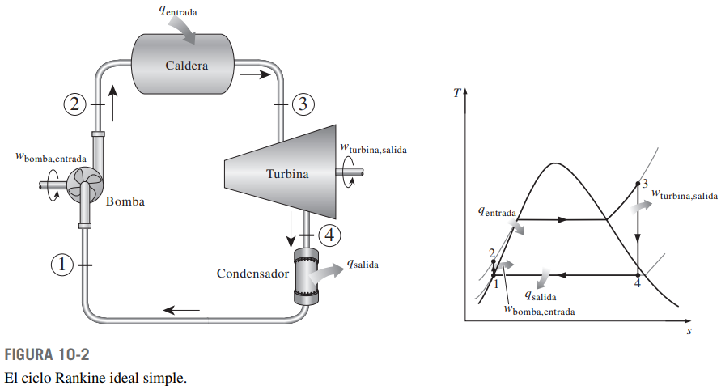

# Ciclo Rankine
Este proyecto implementa una simulación del ciclo Rankine en Python utilizando la biblioteca Bokeh para la visualización de gráficos y pyXSteam para calcular las propiedades termodinámicas del ciclo.



## Requisitos
Las siguientes librerías son necesarias para el funcionamiento de la aplicación:

```bash 
pip install numpy

pip install bokeh

pip install pyXSteam
```

## Uso
Ejecuta la aplicación utilizando:

```bash
bokeh serve --show nombre_del_script.py
```
Esto abrirá una ventana del navegador con la interfaz de usuario para configurar las condiciones del ciclo Rankine.

## Interfaz
La interfaz de usuario proporciona controles para ajustar la temperatura de salida de la caldera, la temperatura de salida del condensador y la compresión de la bomba. Al ajustar estos valores, se simula el ciclo Rankine y se actualizan los gráficos y la información termodinámica en tiempo real.

Se proporciona el gráfico del ciclo con la curva de entropía, también se muestran los datos de cada punto del ciclo. 

# Licencia
Este proyecto está bajo la [Licencia MIT](LICENSE).